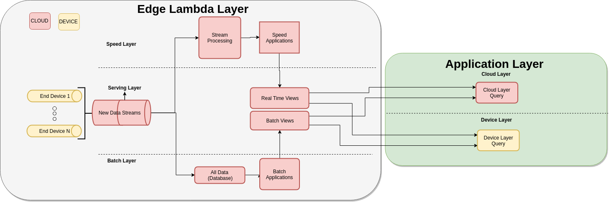
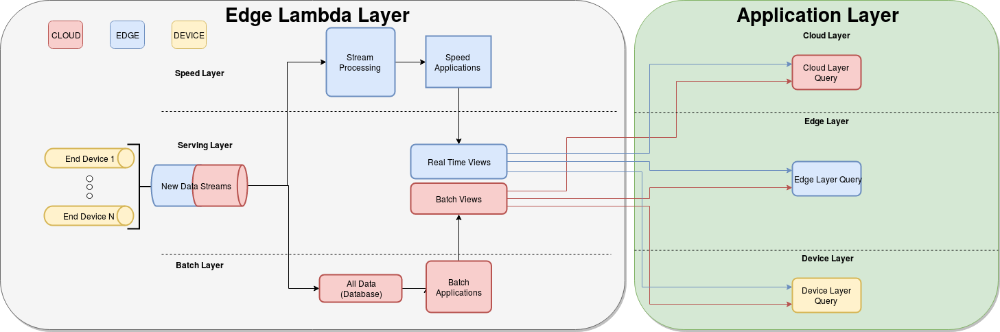
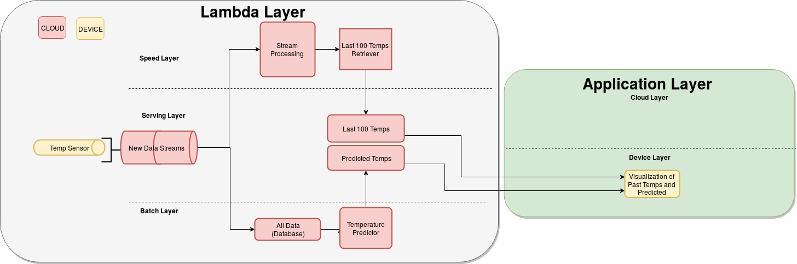
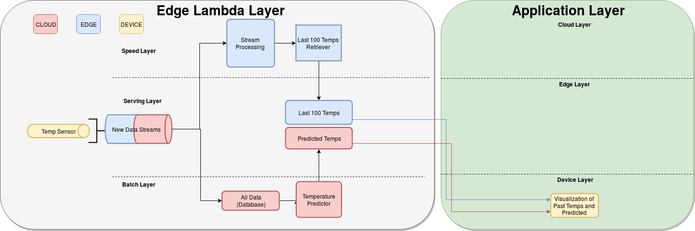

# Temperature Monitoring and Prediction Using a Modified Lambda Architecture
A more detailed write up can be seen in this [report.](./report.pdf)

## Original Lambda Architecture

## Modified Edge-Lambda Architecture

## Original Lambda Architecture for Temp Monitoring and Prediction

## Modified Edge-Lambda Architecture for Temp Monitoring and Prediction

